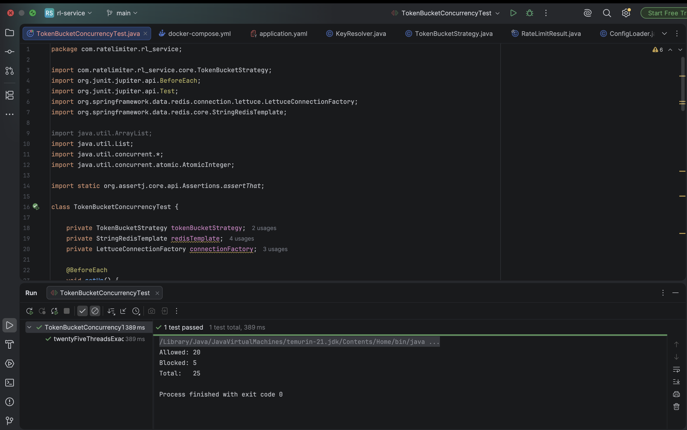
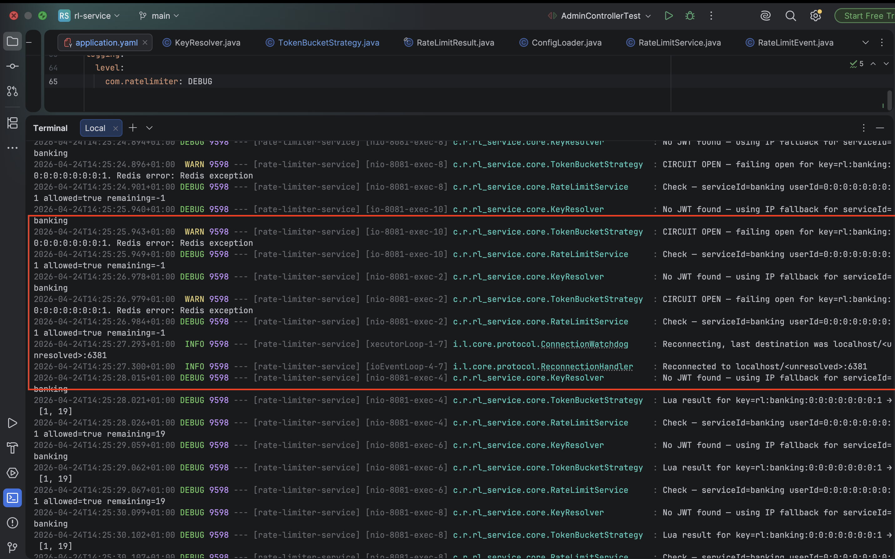
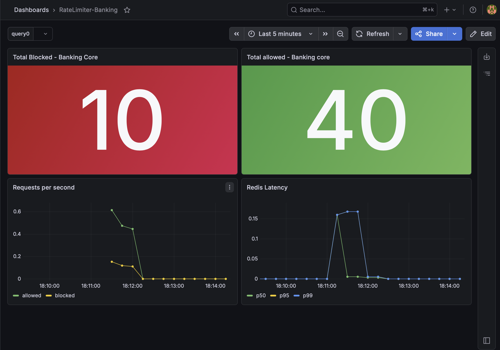

# Rate Limiter Service


## Overview

The Rate Limiter Service is a standalone microservice responsible for
controlling the rate of incoming requests across one or more services.
It exposes a single HTTP endpoint that any service can call to determine
whether an incoming request should be permitted or rejected based on
configurable limits.

The service is designed to operate independently of the services it
protects. Rate limiting logic is centralised in one place, allowing
limits to be updated at runtime without redeploying any dependent service.

This service was built as part of a microservices architecture alongside
a Banking Core API and a Fraud Detection Service, where it acts as the
first layer of protection before authentication and business logic.

## Tech Stack

| Technology | Purpose |
|---|---|
| Spring Boot 3 | REST API, filter chain, dependency injection |
| Redis 7 | Stores token bucket state per user |
| Lua Script | Executes token bucket check atomically in Redis |
| PostgreSQL | Stores rate limit rules per service |
| Caffeine | Caches rules in JVM memory for 60 seconds |
| Resilience4j | Circuit breaker — fails open if Redis is unavailable |
| Micrometer | Exposes metrics for Prometheus scraping |
| Flyway | Database migrations |
| JJWT | Parses Bearer token to extract user identity |
| Docker Compose | Runs Redis, PostgreSQL, Prometheus and Grafana |


## Architecture

The service sits between the calling service and its business logic.
Every incoming request is checked against a configurable limit before
any further processing occurs.

```
Incoming Request
        ↓
┌─────────────────────────────────────────────────────┐
│                 Rate Limiter Service                │
│                                                     │
│  1. Load rule from PostgreSQL (cached 60s)          │
│  2. Extract user identity from JWT                  │
│  3. Execute token bucket check atomically in Redis  │
│  4. Return decision — allowed or blocked            │
└─────────────────────────────────────────────────────┘
        ↓                         ↓
   allowed: true             allowed: false
   remaining: 14             remaining: 0
   (caller proceeds)         (caller returns 429)
```

### How multiple services are supported

Each service that integrates with the rate limiter passes a `serviceId`
with every request. This creates a completely isolated bucket per user
per service.

Adding a new service requires no code changes — only a new rule entry
in the database.


## Features

- **Token Bucket Rate Limiting** — configurable capacity and refill rate
  per service. Supports burst traffic without penalising legitimate users.

- **Per-user isolation** — each user gets their own bucket identified by
  their JWT subject claim. Users never affect each other's limits.

- **Multi-service support** — a single deployment protects multiple services
  simultaneously. Each service has its own isolated rules and buckets.

- **Live rule updates** — rate limit rules are stored in PostgreSQL and
  cached for 60 seconds. Limits can be changed at runtime via the admin
  endpoint without restarting any service.

- **Horizontally scalable** — state lives in Redis, not the JVM. Multiple
  instances of the rate limiter can run behind a load balancer and enforce
  limits correctly across all of them.

- **Fail open** — if Redis becomes unavailable the circuit breaker opens
  and requests are allowed through. A Redis outage never causes an outage
  in the services it protects.

- **Full audit trail** — every rate limit decision is recorded
  asynchronously to PostgreSQL with the user identity, outcome, and
  remaining token count.

- **Observability** — allowed and blocked request counters tagged by
  serviceId, Redis latency histogram, and circuit breaker state exposed
  at `/actuator/prometheus` for Prometheus and Grafana.

- **SDK** — a single-class Java client wraps the HTTP call. Any service
  can integrate in minutes by adding one Maven dependency and calling
  one method.

## Algorithm

The service uses the **Token Bucket** algorithm implemented as an atomic
Lua script executed inside Redis.

Each user gets a bucket with a configurable capacity and refill rate.
Tokens are consumed on every request and refill continuously over time.
When the bucket is empty the request is rejected.

For a detailed explanation see [Design Decisions](docs/DESIGN_DECISIONS.md)

## Design Decisions

For a detailed explanation of all technical decisions made during
the build; algorithm choice, Lua atomicity, fail open rationale,
key strategy, and more see:

[Design Decisions](docs/DESIGN_DECISIONS.md)

## Getting Started

### Prerequisites
- Java 21
- Docker and Docker Compose

### Run

```bash
git clone https://github.com/visurachan/rate-limiter.git
cd rate-limiter
docker compose up -d
./mvnw spring-boot:run
```

### Verify

```bash
curl http://localhost:8082/actuator/health
```

Expected: `{"status":"UP"}`

### Ports

| Service | Port |
|---|---|
| Rate Limiter API | 8082 |
| PostgreSQL | 5435 |
| Redis | 6381 |
| Prometheus | 9091 |
| Grafana | 3001 |

## API Reference

### Check rate limit
```bash
POST /api/v1/rate-limit/check
Authorization: Bearer <jwt>

Body:    { "serviceId": "banking" }

Allowed: { "allowed": true,  "remaining": 14, "resetAt": 1714123516, "retryAfterSeconds": null }
Blocked: { "allowed": false, "remaining": 0,  "resetAt": 1714123516, "retryAfterSeconds": 1   }
```

### Admin
```bash
GET  /admin/rules                          # list all rules
POST /admin/rules                          # create or update a rule
Body: { "serviceId": "banking", "capacity": 20, "refillRate": 5 }
```

### Health and Metrics
```bash
GET /actuator/health      # service health including Redis and DB
GET /actuator/prometheus  # Prometheus metrics scrape endpoint
```

## Testing

### Run all tests

```bash
./mvnw test
```

---

### Concurrency Test — Proof of Correctness

25 threads fire simultaneously against a bucket with a limit of 20.
Asserts exactly 20 allowed and exactly 5 blocked — every single run.
Proves the Lua script is atomic with no race conditions under concurrent load.

```bash
./mvnw test -Dtest=TokenBucketConcurrencyTest
```



---

### Controller Tests

```bash
./mvnw test -Dtest=RateLimitControllerTest
./mvnw test -Dtest=AdminControllerTest
```

---

### Circuit Breaker — Manual Test

```bash
# Terminal 1 — fire continuous requests
while true; do
  curl -s -X POST http://localhost:8082/api/v1/rate-limit/check \
    -H "Content-Type: application/json" \
    -d '{"serviceId": "banking"}' \
    -w " → %{http_code}\n" -o /dev/null
  sleep 1
done

# Terminal 2 — stop Redis
docker stop rl-redis
# Logs show: CIRCUIT OPEN — failing open
# Requests continue returning 200

# Terminal 2 — restart Redis
docker start rl-redis
# Logs show: Reconnected to localhost:6381
# Normal operation resumes
```



---

### Burst Test — Manual

```bash
for i in {1..25}; do
  curl -s -X POST http://localhost:8082/api/v1/rate-limit/check \
    -H "Content-Type: application/json" \
    -d '{"serviceId": "banking"}' \
    -o /dev/null \
    -w "Request $i: %{http_code}\n" &
done
wait
```

---

### Grafana Dashboard




## SDK Integration

The rate limiter ships as a Java SDK making integration straightforward
for any Java service. Add one Maven dependency, create one filter, and
your service is protected.

For full integration instructions see [SDK Integration Guide](docs/SDK_INTEGRATION.md).

## Integration Example — Banking Core API

This service is integrated into a Banking Core API as a reference
implementation. The rate limiter protects the transfer and deposit
endpoints, enforcing a limit of 20 requests per user with a refill
rate of 5 tokens per second.

See the [Banking Core API](https://github.com/visurachan/banking-core-api)
repository for the full implementation.